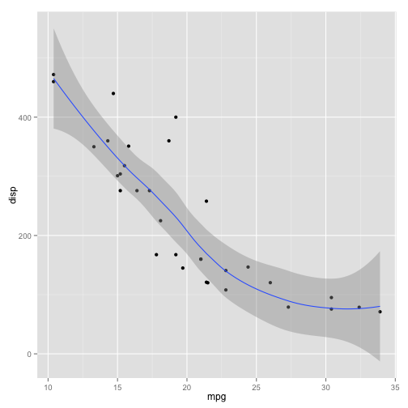
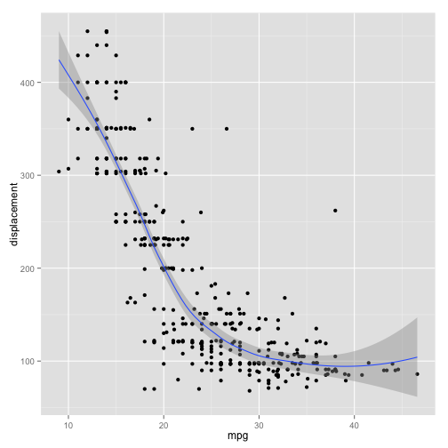

Auto (ISLR) vs. MTCars
========================================================
author: Harold L Trammel
date: Nov. 22, 2015

Motivation
========================================================

* The MTCars dataset is commonly used as example data.
    * Contains 32 observations for 11 variables
    * Standard R dataset component
    * Includes: mpg, cyl, disp, hp, drat, wt, qsec, vs, am, gear, carb
* The Auto dataset from the ISLR library is somewhat richer.
    * Contains 392 observations for 9 variables
    * Wider range of vehicles, including variations on same vehicle
    * Includes: mpg, cylinders, displacement, horsepower, weight, acceleration, year, origin, name

More Data For Analysis
========================================================
MTCars mpg ~ disp
 
***
Auto mpg ~ displacement
 

Comparison of Multiple Regression Models 
========================================================

|Data        |Formula                                                                                          |
|:-----------|:------------------------------------------------------------------------------------------------|
|MTCars      |lm(formula = mpg ~ wt + disp + hp + cyl + qsec, data = cars)                                     |
|Auto (ISLR) |lm(formula = mpg ~ weight + displacement + horsepower + cylinders +   acceleration, data = auto) |

|Coefficents       |MTCars      |Auto (ISLR)    |
|:-----------------|:-----------|:--------------|
|(Intercept)       |35.87361203 |46.26431       |
|wt/weight         |-4.22527033 |-0.005186917   |
|disp/displacement |0.01194976  |-0.00008313012 |
|hp/horsepower     |-0.0158391  |-0.04525708    |
|cyl/cylinders     |-1.15608107 |-0.3979284     |
|qsec/acceleration |0.25381843  |-0.02910471    |

Summary
========================================================

Both datasets have strengths and weaknesses

|Compare          |MTCars                                                                                      |Auto (ISLR)                                                                                     |
|:----------------|:-------------------------------------------------------------------------------------------|:-----------------------------------------------------------------------------------------------|
|Variable Count   |11                                                                                          |9                                                                                               |
|Unique Variables |drat, vs, am, gear, carb                                                                    |year, origin, name                                                                              |
|Observations     |32                                                                                          |392                                                                                             |
|Convenience      |Built in                                                                                    |Have to load ISLR library                                                                       |
|Other            |Carb, am, and drat are useful variables. Car names as rownames. Number of observations low. |Year and origin are useful variables. Car names as separate varible helpful. Many observations. |

